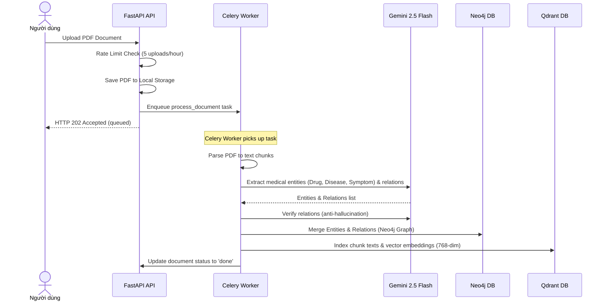
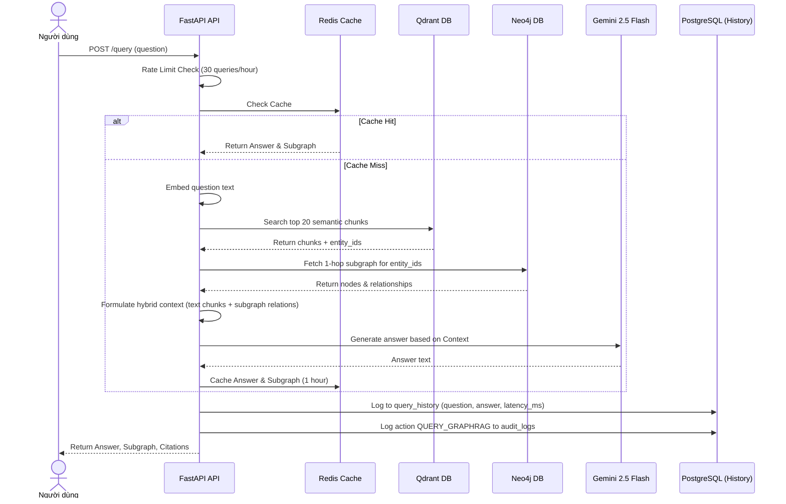

# MKGE — Medical Knowledge Graph Extraction + GraphRAG

MKGE là hệ thống trích xuất đồ thị tri thức y khoa từ tài liệu PDF kết hợp với truy vấn RAG dựa trên đồ thị (GraphRAG) giúp trả lời câu hỏi chính xác, có dẫn chứng rõ ràng và hạn chế tối đa hiện tượng ảo giác (hallucination).

---

## 🏗️ Kiến Trúc Hệ Thống (Architecture Diagram)

```text
       +-------------------------------------------------------+
       |                     FRONTEND (React)                  |
       +---------------------------+---------------------------+
                                   |
                                   | HTTP / WebSocket
                                   v
       +-------------------------------------------------------+
       |                  BACKEND (FastAPI API)                |
       +-------+-------------------+-------------------+-------+
               |                   |                   |
               v                   v                   v
        +--------------+    +--------------+    +--------------+
        |  PostgreSQL  |    |  Neo4j Aura  |    | Qdrant Cloud |
        |  (Supabase)  |    | (Đồ thị y tế)|    | (Vector DB)  |
        +--------------+    +--------------+    +--------------+
               ^
               | (Celery Task Queue via Upstash Redis)
               v
       +-------------------------------------------------------+
       |                     CELERY WORKERS                    |
       |  (Document parsing + Gemini Extraction + Indexing)    |
       +---------------------------+---------------------------+
                                   |
                                   v
                            Gemini 2.5 Flash
```

---

## ⚡ Các Pipeline Chính (Sequence Diagrams)

### 1. Extraction & Indexing Pipeline (Tải lên -> Trích xuất tri thức)


### 2. GraphRAG Query Pipeline (Hỏi đáp y khoa)


---

## 🛠️ Hướng Dẫn Khởi Chạy Nhanh (Quick Start)

### 1. Cấu hình biến môi trường
Sao chép file cấu hình mẫu và điền các tham số kết nối đến database cloud (Supabase, Neo4j, Qdrant, Upstash):
```bash
cp .env.example .env
```

### 2. Khởi chạy bằng Docker Compose
Dễ dàng chạy toàn bộ hệ thống bằng một lệnh duy nhất:
```bash
docker-compose up --build
```

---

## 🔗 Danh Sách API (API Endpoint Catalog)

### Auth & User APIs
* `POST /api/v1/auth/register` — Đăng ký tài khoản mới.
* `POST /api/v1/auth/login` — Đăng nhập và nhận JWT token.
* `POST /api/v1/auth/refresh` — Làm mới access token.
* `POST /api/v1/auth/logout` — Đăng xuất, hủy refresh token.
* `GET /api/v1/users/me` — Lấy thông tin cá nhân hiện tại.

### Document APIs
* `POST /api/v1/documents` — Tải tài liệu PDF y khoa mới lên. (Giới hạn: 5 file/giờ).
* `GET /api/v1/documents` — Liệt kê tài liệu đã tải lên.
* `GET /api/v1/documents/{document_id}` — Lấy chi tiết tài liệu.
* `DELETE /api/v1/documents/{document_id}` — Xóa tài liệu (cascade clean Neo4j, Qdrant và files).
* `GET /api/v1/documents/{document_id}/preview` — Xem trước PDF trong iframe (đã sửa XSS).

### Graph & Query APIs
* `GET /api/v1/graph/document/{document_id}` — Lấy đồ thị tri thức của tài liệu cụ thể.
* `GET /api/v1/graph/entity/{entity_id}` — Xem đồ thị lân cận 1-hop của thực thể.
* `POST /api/v1/query` — Hỏi đáp RAG y khoa. (Giới hạn: 30 câu hỏi/giờ).
* `GET /api/v1/query/history` — Xem lịch sử câu hỏi của người dùng hiện tại.

### Admin APIs
* `GET /api/v1/admin/users` — Xem danh sách người dùng.
* `PATCH /api/v1/admin/users/{user_id}` — Cập nhật vai trò / trạng thái kích hoạt của người dùng.
* `DELETE /api/v1/admin/users/{user_id}` — Xóa người dùng và dọn dẹp triệt để dữ liệu liên quan.
* `GET /api/v1/admin/stats` — Thống kê tổng hợp (Documents, Users, Queries, Neo4j nodes).
* `GET /api/v1/admin/audit` — Xem nhật ký hoạt động hệ thống (Audit Logs).

---

## 📈 Trạng Thái Dự Án (Project Status)

* **Phase 0 (Foundation) - DONE**
  * Đăng ký, đăng nhập JWT, xoay vòng Refresh Token.
  * Thiết kế Schema PostgreSQL & cấu hình Alembic migration.
* **Phase 1 (Document Management) - DONE**
  * Tải lên PDF, lưu trữ file cục bộ và cập nhật trạng thái.
* **Phase 2 (Knowledge Extraction) - DONE**
  * Trích xuất thực thể, quan hệ với Gemini 2.5 Flash và lưu vào Neo4j + Qdrant.
* **Phase 3 (GraphRAG Query) - DONE**
  * Tìm kiếm ngữ nghĩa kết hợp đồ thị tri thức để hỏi đáp y khoa.
* **Phase 4 (Polish & Admin Console) - DONE**
  * Triển khai Rate Limiting (sliding window counter qua Redis).
  * Dashboard quản trị của Admin cùng Audit Logging toàn hệ thống.
  * Bộ unit test phủ toàn bộ ứng dụng và kiểm tra bảo mật XSS.
